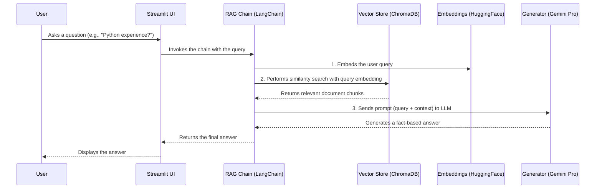

# 🤖 CV-Bot: Your Personal Career Assistant


Welcome to CV-Bot! This is a web-based chatbot designed to answer questions about Neel's professional experience. It uses a Retrieval-Augmented Generation (RAG) system to provide accurate, context-aware answers based on my CV and other professional documents.

This project demonstrates proficiency in building modern, end-to-end AI applications with large language models.

### 🔗 Live Demo

**You can try out the live application here:** [LINK TO YOUR HUGGING FACE SPACES DEMO WHEN DEPLOYED]

---

### 🛠️ Tech Stack

- **LLM:** Google Gemini Pro
- **Orchestration:** LangChain
- **Embeddings:** `all-MiniLM-L6-v2` (via Hugging Face)
- **Vector Store:** ChromaDB
- **Web Framework:** Streamlit
- **Deployment:** Hugging Face Spaces

---

### 🏛️ Architecture

This application uses a Retrieval-Augmented Generation (RAG) architecture. The diagram below illustrates the flow from user query to generated response:



### 🚀 How to Run Locally

To run this project on your own machine, follow these steps:

1.  **Clone the repository:**
    ```bash
    git clone https://github.com/[YOUR_USERNAME]/[YOUR_REPO_NAME].git
    cd [YOUR_REPO_NAME]
    ```

2.  **Set up a Python virtual environment:**
    ```bash
    python -m venv .venv
    source .venv/bin/activate
    ```
    *(On Windows, use `.venv\Scripts\activate`)*

3.  **Install the dependencies:**
    ```bash
    pip install -r requirements.txt
    ```

4.  **Create a `.env` file** in the root directory and add your Gemini API key:
    ```
    GEMINI_API_KEY="YOUR_API_KEY_HERE"
    ```

5.  **Run the Streamlit application:**
    ```bash
    streamlit run app.py
    ```

---

### 🧠 Challenges & Future Improvements

- **Challenge:** One of the initial challenges was ensuring reliable authentication with the Google Cloud APIs, which led to a deeper understanding of ADC vs. API Key authentication methods.

- **Improvement:** A future enhancement would be to implement source citation, where the chatbot not only provides an answer but also shows which specific parts of the CV were used to generate it.
